# Integration Lite Post-TX Uploader — User Guide

## What is the Integration Lite Post-TX Uploader?

The Integration Lite Post-TX Uploader is a tool that takes publication data from a spreadsheet and sends it to TEP (The Everyone Project) for processing. It converts each row of your spreadsheet into the format TEP expects and uploads it automatically.

The application runs entirely in your web browser — nothing is installed on your computer and no data passes through any intermediate server.

The screenshots in this guide were taken by walking a real test spreadsheet through the whole process, so what you see here is exactly what you will see on screen.

## Getting Started

### Settings

Before you can upload anything, you need to configure the app with the connection details provided to you by TEP. You will need four pieces of information:

- **Access Key ID**
- **Secret Access Key**
- **Bucket Name**
- **Region**

Click the settings icon (⚙, top-right of the navigation bar) to open the Settings panel:

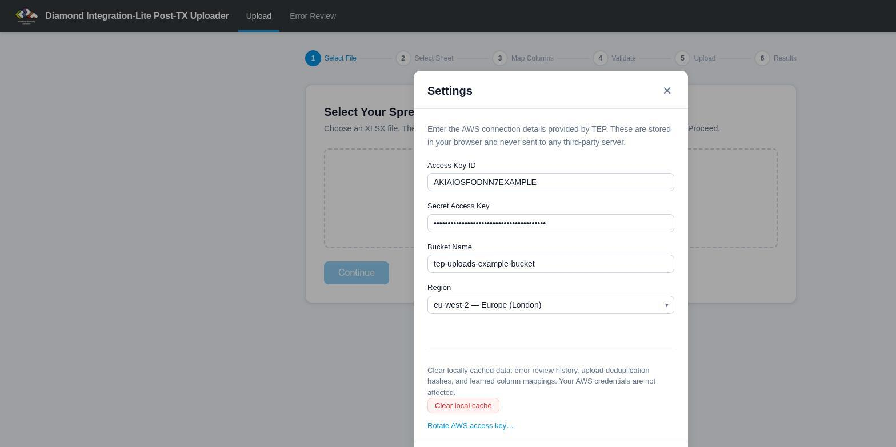{width=100%}

Your credentials are saved in your browser so you only need to do this once (unless you clear your browser data or switch browsers). The Settings panel can be opened at any time without losing your place in the upload process. It also contains a **Clear local cache** button (resets error review history, duplicate detection and learned column mappings — your credentials are kept) and a **Rotate AWS access key…** link for when TEP asks you to change your access key.

Once you have entered the details, click **Test connection**. The app checks each part of the setup in turn — your network, the bucket name and region, the access key, the secret, and finally that the key is allowed to write to the bucket — without uploading anything. If something is wrong, the message tells you which part it is and what to do about it:

| Message | What it means | What to do |
|---|---|---|
| Some connection details are missing / doesn't look right | A field is empty, has stray spaces, or is the wrong shape | Re-copy the value from what TEP sent you |
| Your network or browser is blocking Amazon S3 | This computer cannot reach amazonaws.com at all | Try another network, disable ad-blocker extensions, or ask your IT team |
| Amazon S3 is reachable, but the bucket could not be contacted | The bucket name or region does not match what TEP sent | Check both carefully; if they are right, contact support |
| Access key ID not recognised | The key has been mistyped, rotated or deactivated | Enter the current key, or ask TEP for a new one |
| Secret access key doesn't match the key ID | The key ID is right but the secret is not the one that goes with it | Re-enter the secret |
| Your computer's clock is wrong | AWS rejects requests from computers more than 15 minutes out | Correct the date and time |
| Keys accepted, but they cannot read the bucket | Uploads will work, but duplicate detection and Error Review will not | Contact support |
| Everything looks OK at your end, but there appears to be a problem with the TEP bucket | Your details are all correct; the bucket itself is refusing writes | Contact support and quote the reference shown |

If the app detects that settings are missing when you start an upload, it will prompt you to enter them.

## Preparing Your Spreadsheet

Your data goes in an ordinary XLSX spreadsheet — one row per publication event, with a header row naming each column. You can create it in Excel or Google Sheets (export/download as `.xlsx` from Google Sheets). Here is a small example being prepared in Google Sheets:

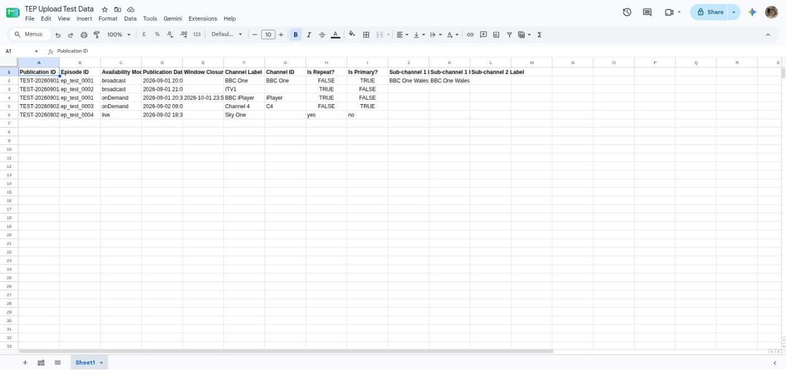{width=100%}

Using the standard column headings shown above means the app will match every column automatically. Other headings will still work — you just may need to confirm the matching by hand (once — the app remembers your choice; see [Tips](#tips)).

### Required Fields

You must provide data for the following fields:

- **Publication ID** — a unique identifier for this broadcast event
- **Episode ID** — the identifier for the episode that was broadcast
- **Availability Mode** — must be exactly `broadcast` or `onDemand`
- **Publication Date and Time** — the transmission date/time (for broadcast) or start of availability window (for on-demand). The column should be formatted as a **Date** in your spreadsheet — the app will handle the rest. Alternatively, a text cell is accepted if it contains a full ISO 8601 date/time including a timezone, e.g. `2026-06-01T20:00:00Z`. Text in any other date format (e.g. `01/06/2026 20:00`) is rejected.
- **Channel Label** — the channel or platform name (e.g. "BBC One", "iPlayer")

### Optional Fields

- **Is Repeat?** — whether this is a repeat broadcast (defaults to `true` if omitted). Accepted values: `true`/`false`, `yes`/`no`, `y`/`n`, or `1`/`0`.
- **Is Primary?** — whether this is the primary broadcast (defaults to `false` if omitted). Accepted values: same as above.
- **Window Closure Date and Time** — end of availability window. Must be a **Date**-formatted column (or ISO 8601 text with timezone, as for Publication Date and Time). Only valid for on-demand content (`Availability Mode: onDemand`). Including this field on a broadcast row will cause a validation error.
- **Channel ID** — a machine-readable channel identifier (defaults to the Channel Label if omitted)
- **Sub-channel 1–4 Label and ID** — regional variants or sub-channels (e.g. "BBC One Wales"). Up to four sub-channels are supported. If a sub-channel ID is omitted, it defaults to the sub-channel label.

## Uploading Data

The progress bar across the top of the app shows the six steps of an upload: **Select File → Select Sheet → Map Columns → Validate → Upload → Results**. Steps that need no input from you are skipped automatically.

### Step 1: Select Your Spreadsheet

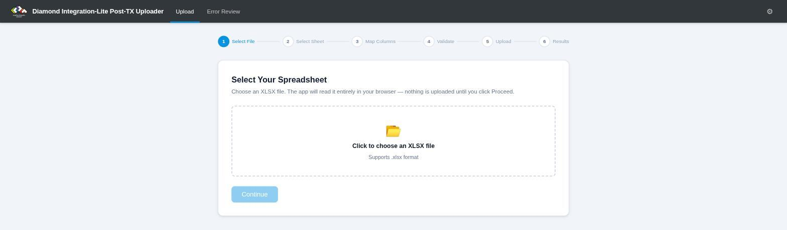{width=100%}

Click the file selector and choose your XLSX spreadsheet. The app will check that the file can be read. If there is a problem with the file, you will see an error message.

Once a file is chosen you will also see a checkbox labelled **"Skip column review if all columns matched OK"**:

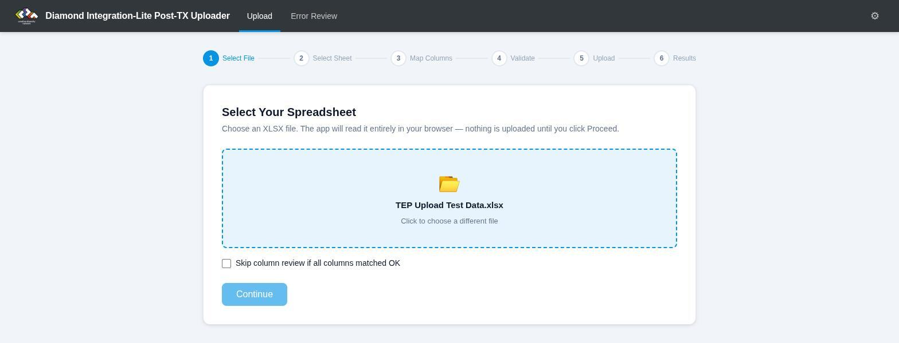{width=100%}

If you tick this, the app will try to automatically match your spreadsheet columns to the expected fields and skip the review step if everything matches perfectly. This is useful if you upload the same format regularly and want to save time:

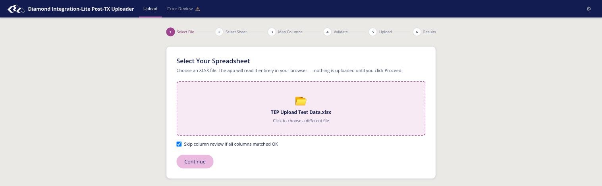{width=100%}

### Step 2: Select Sheet

If your workbook contains more than one sheet, you will be asked to choose which sheet to process. If there is only one sheet, this step is skipped automatically.

### Step 3: Map Columns

The app needs to know which column in your spreadsheet corresponds to which piece of data. It will attempt to do this automatically by looking at your column headers.

If automatic matching was not perfect (or you chose not to skip the review), you will see the **Map Columns** screen. This shows every expected field alongside a dropdown where you can select the matching column from your spreadsheet:

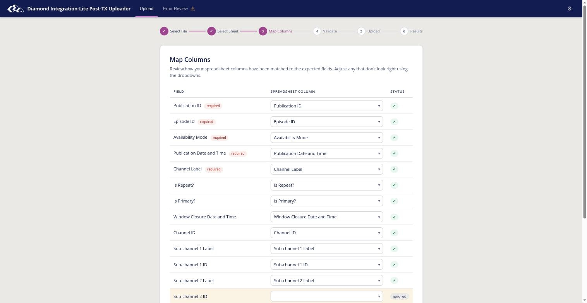{width=100%}

- Fields with a green tick are matched and ready.
- Fields highlighted in **red** are mandatory — you must assign a column to each of these before you can proceed.
- Fields highlighted in **amber** are optional — if your spreadsheet does not include this data, leave the dropdown set to "Ignore this column". They are marked **ignored**:

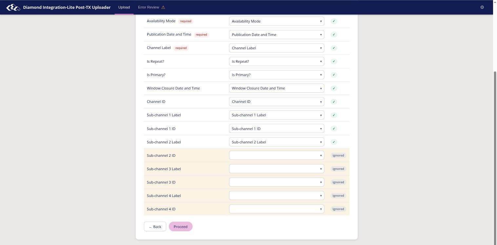{width=100%}

You cannot assign the same spreadsheet column to two different fields. The **Proceed** button will only become active once all mandatory fields are assigned and there are no conflicts.

### Step 4: Validation

Before uploading anything, the app checks every row in your spreadsheet for data problems. This includes:

- **Format checks** — date/time columns must be formatted as Date in your spreadsheet, or contain ISO 8601 text with a timezone (e.g. `2026-06-01T20:00:00Z`); text in any other date format is rejected. Availability Mode must be `broadcast` or `onDemand`; Is Repeat? and Is Primary? must be `true` or `false`.
- **Cross-field checks** — for example, Window Closure Date and Time may only appear on rows where Availability Mode is `onDemand`.

If any rows fail validation, a **Validation Report** is shown. In this example, row 6 of the test spreadsheet contains `live` in the Availability Mode column, which is not an accepted value:

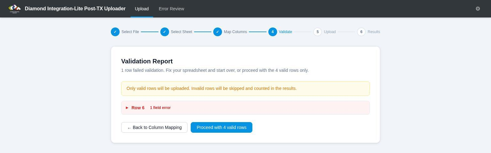{width=100%}

Click a failing row to expand it. All of its field values are listed, and invalid fields are highlighted in red with a description of the problem:

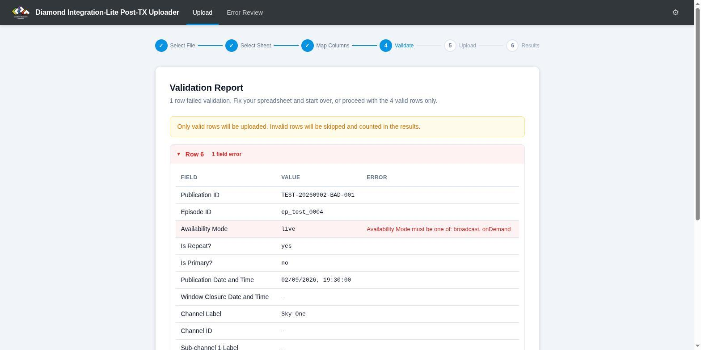{width=100%}

You can either go back to correct your spreadsheet, or choose to proceed with only the valid rows (invalid rows will be skipped and reported in the final results).

If all rows pass, this step is skipped automatically.

### Step 5: Upload

A confirmation screen shows how many rows are about to be uploaded. Nothing has been sent yet at this point:

{width=100%}

Once you click **Upload**, the app first runs the same connection test as the Settings panel. If it fails, nothing is uploaded and you will see the same specific message, with buttons to open Settings or try again. If it passes, the app will process each valid row of your spreadsheet and upload it. A **progress bar** shows how many rows have been processed:

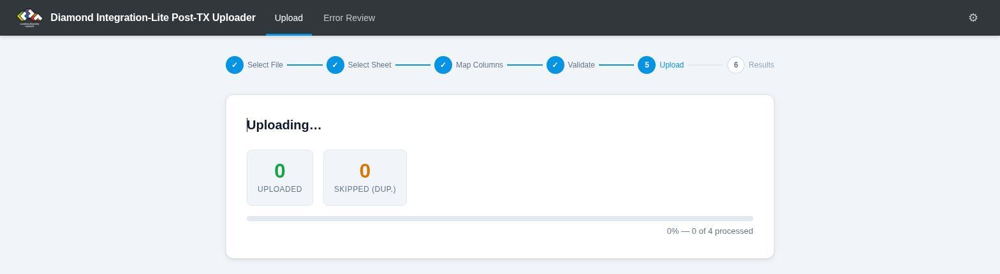{width=100%}

The app automatically detects and skips duplicate rows — if the same data has already been uploaded (from this browser or another), it will not upload it again.

If an upload fails part-way through, the app will stop and show you the record that failed, together with a plain-English explanation of why (for example, that the connection to Amazon S3 was lost). Any rows that were uploaded before the failure are safe and do not need to be re-uploaded.

### Step 6: Results

After processing, you will see a summary:

{width=100%}

- How many rows were **uploaded successfully**.
- How many rows were **skipped** because they were duplicates.
- How many rows were **skipped** because they failed validation.
- If there was a **failure**, the details of the record that failed.
- How many rows were **not processed** (rows remaining after a failure).

If there are unprocessed rows, you will see a **Retry** button. You can safely click this — rows that were already uploaded will be automatically skipped, so only the remaining rows will be processed.

Uploading the same spreadsheet a second time is harmless. Here is the result of re-uploading the file from the walkthrough above — every previously uploaded row is skipped as a duplicate:

{width=100%}

## Error Review

After you upload data, TEP processes each file asynchronously. If a file is processed successfully, a status receipt is written to a "complete" folder (the uploaded file itself is removed). If there is a problem, the file is moved to an "errors" folder along with an XML error report describing what went wrong.

The **Error Review** tab lets you see the results of this processing.

### Viewing Batches

Click the **Error Review** tab in the navigation bar. The app will scan the S3 bucket and display a list of upload batches. Each batch corresponds to one upload session (one click of the "Upload" button):

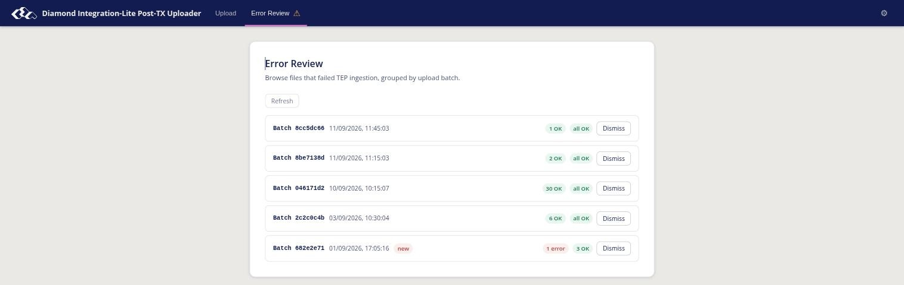{width=100%}

For each batch, you will see:

- How many files **errored** during processing (shown in red)
- How many files were **OK** (shown in green)
- A **new** badge if you haven't viewed the batch yet

Click **Refresh** to re-scan the bucket for the latest results. Processing happens asynchronously, so newly uploaded files may not appear immediately — a batch you uploaded a few minutes ago may not be listed yet.

### Viewing Error Details

Click on any batch that has errors to see the details. The app will download the error reports from S3 and show you:

- The **publication ID** of each failed record (extracted from the uploaded XML)
- The **processing stage** where the error occurred (e.g. "VALIDATING") and TEP's one-line **summary** of why the file was rejected
- The **number of errors** and their **severity** — *error* means the data needs correcting before resubmission; *critical* means processing failed at TEP's end and the file can be resubmitted unchanged
- The **full error message** for each error, with the **field** and **line number** it concerns where TEP can place it

Click the arrow on any error row to expand it and see all errors, warnings, and processing metrics.

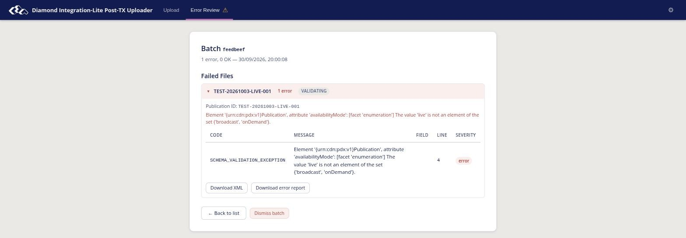{width=100%}

### Downloading Files

From the batch detail view, you can download the original **XML file** that was uploaded and the **XML error report** generated by TEP (the **Download XML** and **Download error report** buttons in the screenshot above). This is useful for debugging or sharing with support.

### Dismissing Batches

Once you have dealt with the errors in a batch (e.g. fixed the spreadsheet and re-uploaded), click **Dismiss** to hide it from the list. Dismissed batches will not appear again.

The actual files remain in the S3 bucket — the dismiss action only hides them from your view. TEP removes old files from the "complete" and "errors" folders 7 days after they are created.

### Notes

- You need AWS credentials configured in Settings before you can use Error Review.
- The error review cache is stored in your browser. If you clear your browser data, all batches will reappear as "new" (until they are removed by the bucket lifecycle policy).
- Only files uploaded by this tool are shown. Files uploaded by other means are ignored.

## Tips

- You can upload the same spreadsheet multiple times without worrying about creating duplicates — the app will detect and skip them (see the Results screenshot above).
- **The app learns your column names.** The first time you confirm a column mapping on the Map Columns screen, the app saves your column header for that field. Next time you upload a spreadsheet with the same column names, the app will match them automatically — no review needed.
- Ideally, format your date/time columns as **Date** in Excel or Google Sheets. The app reads the cell type directly, so a text cell will be flagged as invalid even if it *looks* like a date — applying a date display format to a text cell does not make it a real date. The one exception: text cells are accepted when they contain a complete ISO 8601 date/time with timezone, e.g. `2026-06-01T20:00:00Z`. To check whether a cell holds a real date or text, use `=ISNUMBER(A2)` — real dates return TRUE. (Tip: typing dates as `2026-09-01 20:00:00` in Google Sheets produces a real date cell regardless of your locale.)
- If you change browsers or clear your browser data, you will need to re-enter your AWS settings. Previously uploaded data is not affected — it is already safely stored.
- The app works entirely in your browser. Your AWS credentials and data are not sent to any third-party server.
